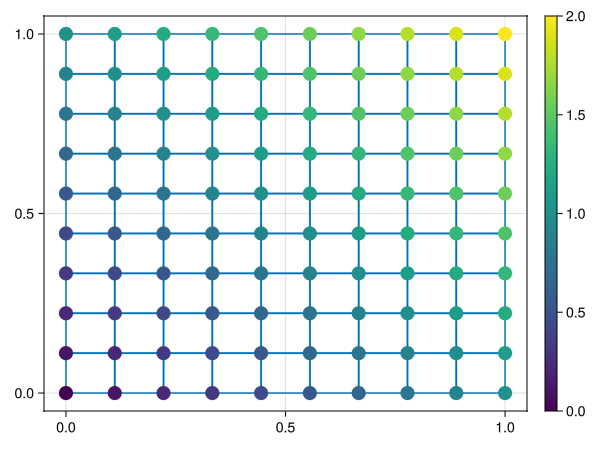

# BcubeMakie.jl
Some Makie visualization routines for `Bcube`.

```julia
using Bcube
using BcubeMakie
using GLMakie

bmesh = rectangle_mesh(10, 10)
u = PhysicalFunction(x -> sum(x))
fig, ax, pl = plot(bmesh, u; markersize = 20)
Colorbar(fig[1, 2], pl)
```

