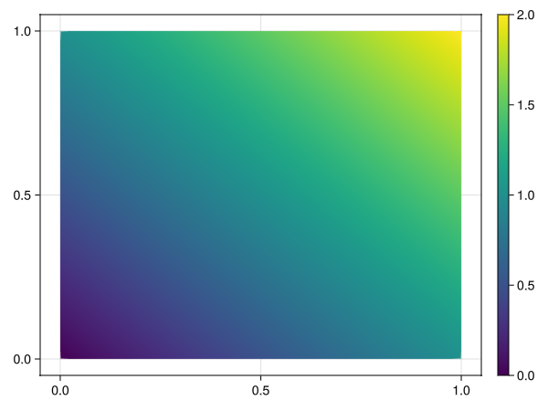
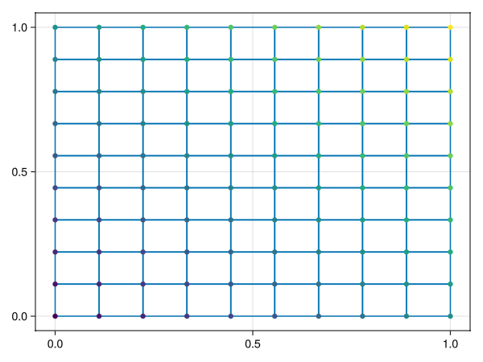

# BcubeMakie.jl
Some Makie visualization routines for `Bcube`.

```julia
using Bcube
using BcubeMakie
using GLMakie

bmesh = rectangle_mesh(10, 10)
u = PhysicalFunction(x -> sum(x))
fig, ax, plt = plot(bmesh, u)
Colorbar(fig[1, 2], plt)
display(fig)
```


Checkout `examples/gallery/gallery.jl` for more examples.

The most usefull function is `BcubeMakie.bcube_mesh_to_makie_mesh(::Bcube.AbstractMesh)`: it converts a `Bcube.AbstractMesh` into an object that Makie can plot. You can plot everything however you like:
```julia
using Bcube
import BcubeMakie: bcube_mesh_to_makie_mesh
using GLMakie

bmesh = rectangle_mesh(10, 10)
u = PhysicalFunction(x -> sum(x))

makie_mesh = bcube_mesh_to_makie_mesh(bmesh)
color = var_on_vertices(u, bmesh)

fig, ax, plt = wireframe(makie_mesh)
scatter!(plt, makie_mesh; color, overdraw = true)
display(fig)
```
